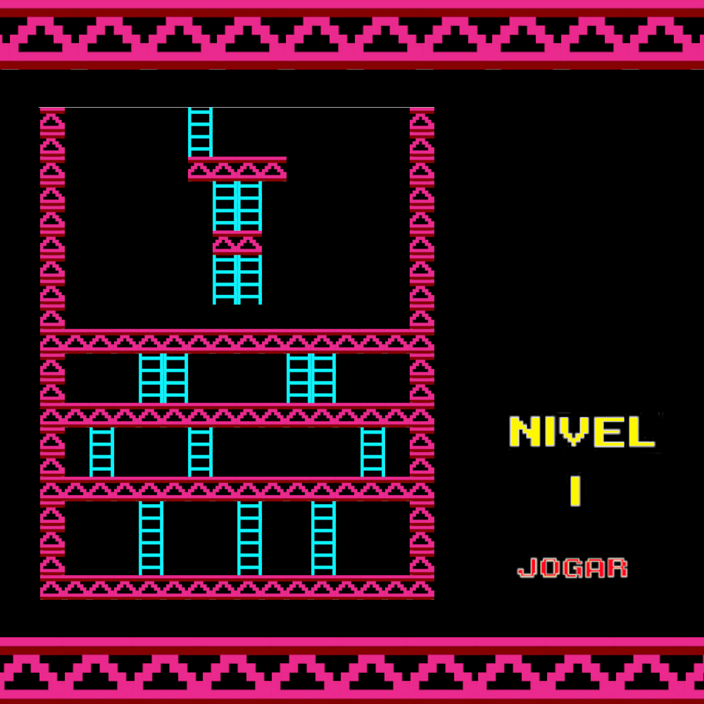

# Donkey Kong (Clone) — Laboratory of Informatics I (LI1)



Clone of the Donkey Kong game implemented in Haskell, using the Gloss library for rendering and input. Developed as a project for the Laboratory of Informatics I (LI1) course, part of the first-year curriculum of the Software Engineering degree at the University of Minho.

The repository contains the game implementation as well as the coursework tasks and unit tests associated with the course assignments.

This project obtained a final grade of 17/20.


## Repository structure

- `src/` — Main game code (e.g., `Main.hs`).
- `lib/` — Implementations of the course tasks and helper modules.
- `imagens/` — Graphic assets: blocks, enemies, player, menus, collectibles.
- `Test/` — Unit tests (specs) used to validate the tasks.
- `primate-kong.cabal` — Cabal package description file.

## Requirements

- GHC (Glasgow Haskell Compiler)
- Cabal (recommended to manage dependencies and run the project)
- Gloss library
- HUnit (included if needed for tests)

## Open the interpreter (GHCi)

You can open the Haskell interpreter using `cabal` or directly with `ghci`.

1. Using `cabal`

```bash
$ cabal repl
```

2. Using `ghci` directly (load `src`):

```bash
$ ghci -i="src" -i="lib" src/Main.hs
```

## Run the game

If the project is configured with `cabal` you can build and run it with:

```bash
$ cabal build
$ cabal run
```

Or, for quick testing without building, you can use `ghci` and call the `main` function from the interpreter:

```bash
# inside ghci
> main
```

## Tests

Unit tests use HUnit (or a small custom test framework in the `Spec`s). You have several alternatives to run them:

1. Using `cabal`

```bash
$ cabal test
```

2. Using `ghci` to load the specs manually

```bash
$ ghci -i="lib" -i="Test" Test/Spec.hs
# inside ghci run the exposed test functions, for example:
# >>> runTestsT1
# >>> runTestsT2
# >>> main  -- if there is a top-level main that runs all tests
```

3. Using `runhaskell` to run a spec directly

```bash
$ runhaskell -i="lib" -i="Test" Test/Spec.hs
```

## Documentation

You can generate Haddock documentation with:

1. Using `cabal`

```bash
$ cabal haddock --haddock-all
```

2. Using `haddock` directly

```bash
$ haddock -h -o doc/html src/*.hs lib/*.hs
```

## Game controls (example)

- Left / Right arrows — move the player
- Space bar — jump
- Attack key (e.g., H) — use hammer/attack (if implemented)
- Esc — pause / return to menu

(If you want, I can update this section with the exact controls used in the code.)

## Assets (images & sounds)

All graphic resources are located in the `imagens/` folder with subfolders for blocks, enemies, player, menus, and collectibles. Keep the files in this structure so the game's relative paths continue to work.

## Development notes

- The code is organized into modules to help complete the course tasks.
- It is recommended to use `cabal repl` during development to quickly reload modules.
- If you modify assets (images), make sure the paths referenced in the code remain correct.

## Group / Author

- Afonso Martins — https://github.com/AfonsoMartins26

- Salomé Faria — https://github.com/faria-s 

## License

This repository was developed as academic coursework. Feel free to reuse or study the code, but please attribute the original source.
